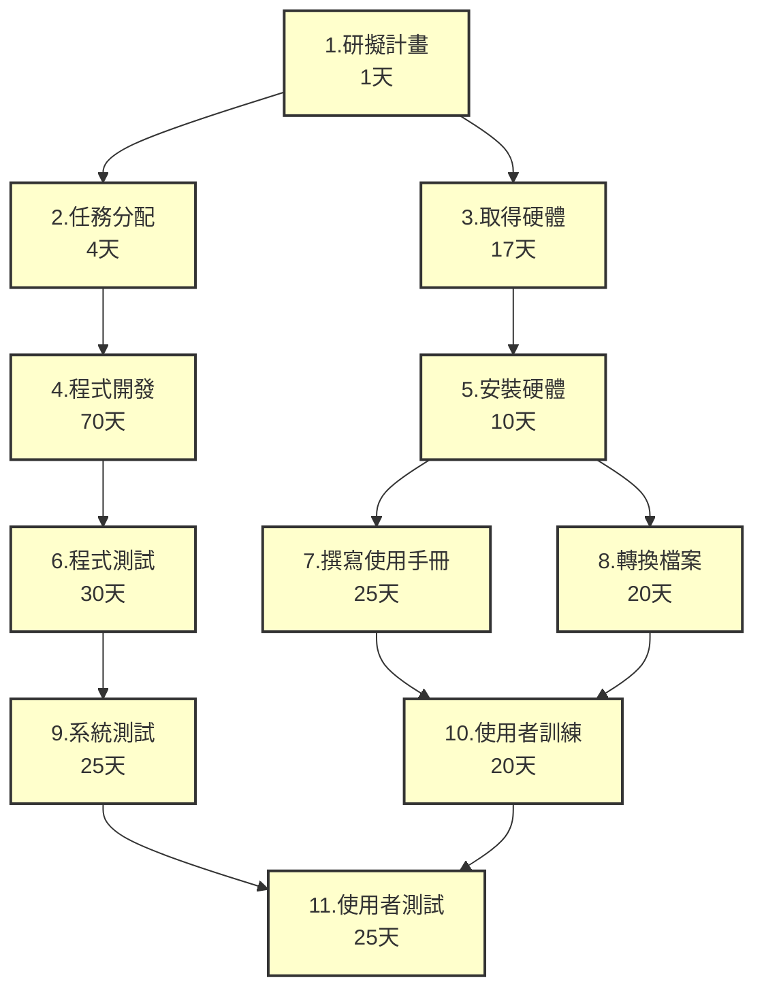
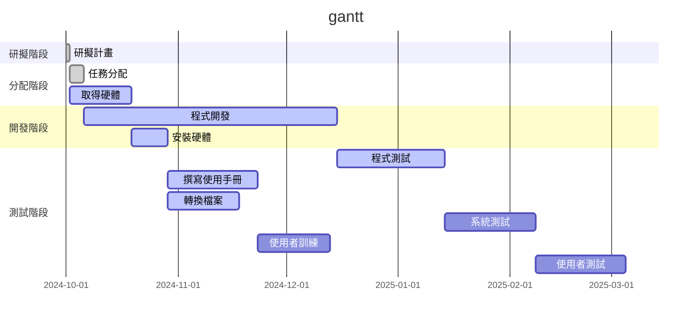
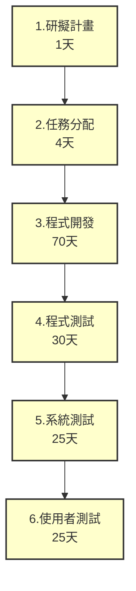

### PERT/CPM 

```mermaid
graph TD;
    A[1.研擬計畫<br/>1天] --> B[2.任務分配<br/>4天];
    A --> C[3.取得硬體<br/>17天];
    B --> D[4.程式開發<br/>70天];
    C --> E[5.安裝硬體<br/>10天];
    D --> F[6.程式測試<br/>30天];
    E --> G[7.撰寫使用手冊<br/>25天];
    E --> H[8.轉換檔案<br/>20天];
    F --> I[9.系統測試<br/>25天];
    G --> J[10.使用者訓練<br/>20天];
    H --> J;
    I --> K[11.使用者測試<br/>25天];
    J --> K;
    
    classDef task fill:#ffffcc,stroke:#333,stroke-width:2px;
    class A,B,C,D,E,F,G,H,I,J,K task;
```
### 甘特圖

```mermaid
gantt
    dateFormat  YYYY-MM-DD
    title gantt

    section 研擬階段
    研擬計畫      :done, des1, 2024-10-01, 1d

    section 分配階段
    任務分配      :done, des2, 2024-10-02, 4d
    取得硬體      :active, des3, 2024-10-02, 17d

    section 開發階段
    程式開發      :active, des4, 2024-10-06, 70d
    安裝硬體      :active, des5, 2024-10-19, 10d

    section 測試階段
    程式測試      :active, des6, 2024-12-15, 30d
    撰寫使用手冊  :active, des7, 2024-10-29, 25d
    轉換檔案      :active, des8, 2024-10-29, 20d
    系統測試      :des9, 2025-01-14, 25d
    使用者訓練    :des10, 2024-11-23, 20d
    使用者測試    :des11, 2025-02-08, 25d

```
### 路徑圖

```mermaid
  graph TD;
    A[1.研擬計畫<br/>1天] --> B[2.任務分配<br/>4天];
    B --> C[3.程式開發<br/>70天];
    C --> D[4.程式測試<br/>30天];
    D --> E[5.系統測試<br/>25天];
    E --> F[6.使用者測試<br/>25天];
    classDef task fill:#ffffcc,stroke:#333,stroke-width:2px;
    class A,B,C,D,E,F task;

```
